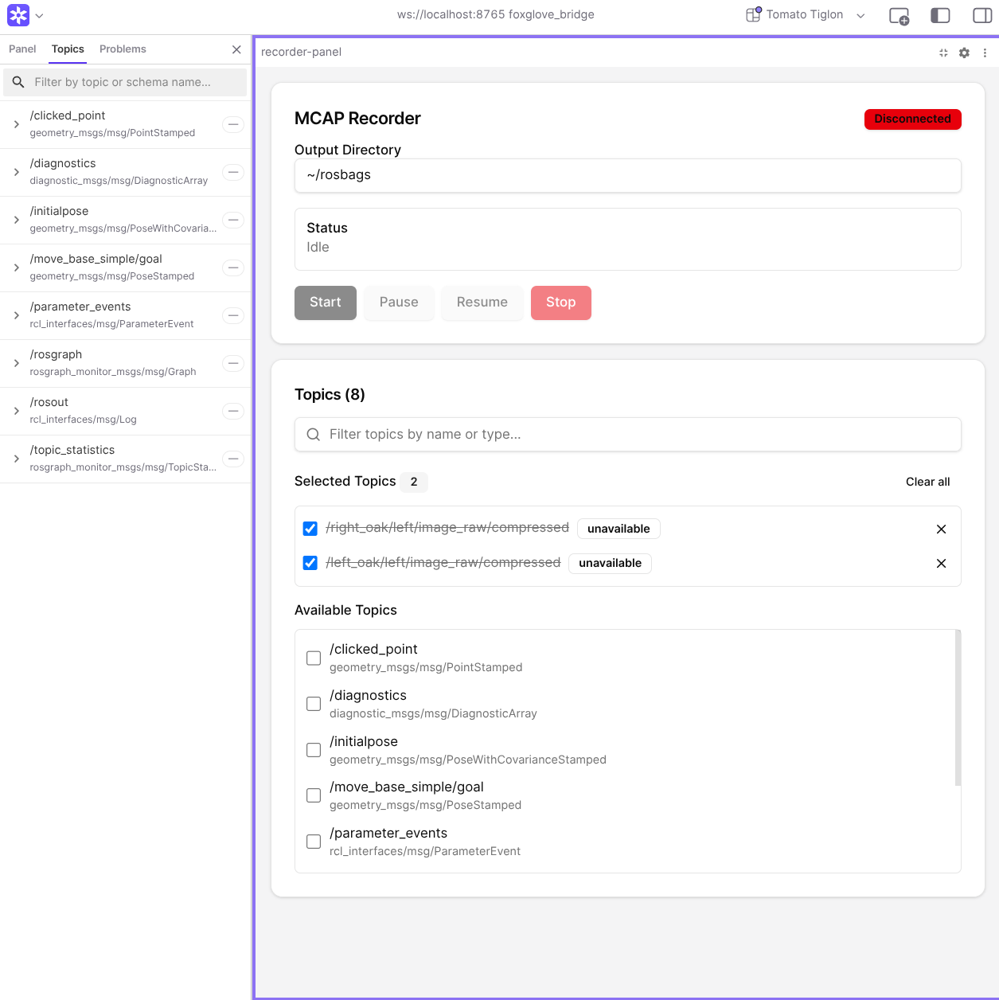

# MCAP Recorder

A Foxglove extension panel for controlling MCAP recording sessions with a ROS2 companion node.



## Features

- **Topic Selection**: Browse available ROS topics.
- **Recorder Controls**: Start, pause, resume, and stop recording
- **Status Monitoring**: Real-time recorder status from companion node
- **State Persistence**: Selected topics and output directory persist across sessions

## Prerequisites

This extension requires the **ROS2 companion node** to be running on your ROS2 system:

- **ROS2 Package**: [qrafty-ai/foxglove_recorder_ui_ros2](https://github.com/qrafty-ai/foxglove_recorder_ui_ros2)
- Clone and build this package in your ROS2 workspace before using the extension
- Start companion node:
```bash
ros2 run recorder_companion recorder_companion_node
```

## Installation

### Option 1: Install from GitHub Release (Recommended)

1. Download the latest `.foxe` file from the [GitHub Releases](https://github.com/qrafty-ai/foxglove_recorder_ui/releases) page
2. Open Foxglove Studio
3. Go to **Extensions** → **Install Extension**
4. Select the downloaded `.foxe` file

### Option 2: Build from Source

```bash
# Clone the repository
git clone https://github.com/qrafty-ai/foxglove_recorder_ui.git
cd foxglove_recorder_ui

# Install dependencies
npm install

# Build the extension
npm run build

# Package the extension (creates .foxe file)
npm run package

# Install locally for testing
npm run local-install
```

## Usage

1. **Install the extension** using one of the methods above
2. **Install and run the ROS2 companion node**:
   ```bash
   # In your ROS2 workspace
   git clone https://github.com/qrafty-ai/foxglove_recorder_ui_ros2.git src/foxglove_recorder_ui_ros2
   colcon build --packages-select recorder_companion
   source install/setup.bash
   ros2 run recorder_companion recorder_node
   ```
3. Open Foxglove Studio
4. Add the **"MCAP Recorder"** panel to your layout
5. Connect to your ROS2 system
6. Select topics and control recording

## Development

```bash
# Install dependencies
npm install

# Build extension
npm run build

# Package extension (creates .foxe file)
npm run package

# Install for local testing
npm run local-install

# Run tests
npm test

# Run type check
npm run lint
```

## Project Structure

- `src/` - Extension source code (React components, logic)
- `dist/` - Built extension output
- `ros2_ws/` - ROS2 companion workspace (optional, for local development)
- `.github/workflows/` - CI/CD automation

## License

MIT

## Related Projects

- [ROS2 Companion Node](https://github.com/qrafty-ai/foxglove_recorder_ui_ros2) - Required ROS2 package for this extension
